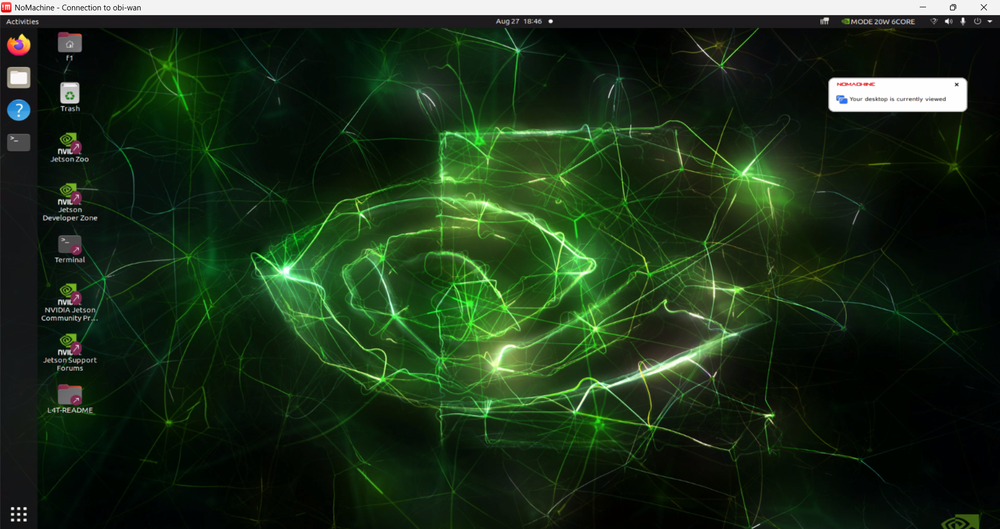
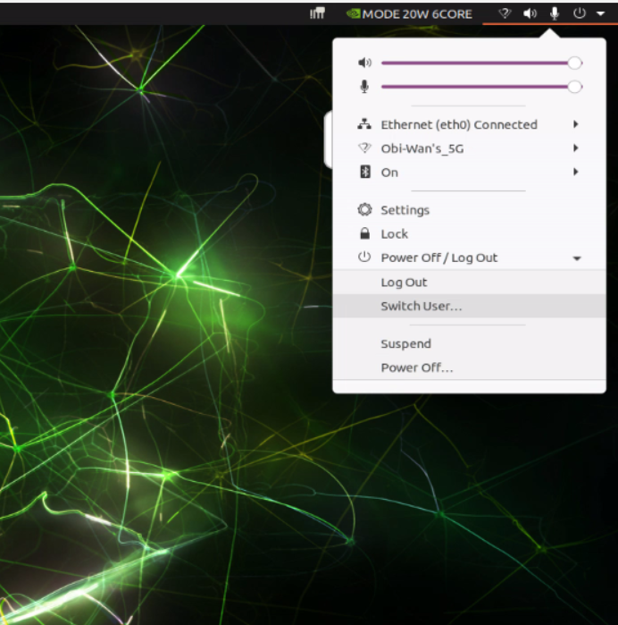

# UNLV F1Tenth - Using the Car

This guide will show you how to get on the car and use it.

## Getting on the car using SSH

To get on the car via the command line, use the following command, replacing `<team-name>` with your team's name and `<car-name/ip-address>` with the car's name or IP address.

```
ssh <team-name>@<car-name/ip-address>
```

It will ask you for the account's password, then you'll be able to access the machine via command line. You should see the following when logging in:

TODO replace info here

### Changing Passwords

Upon first logging in, please change your password using:

```bash
passwd
```

Then follow the prompts as needed.

## Copying Over Files Using SCP

Copying over a directory is very similar to using SSH. The syntax of the command is

```
scp -r <source> <destination>
```

where `<source>` is the source directory and `<destination>` is the (parent) directory in which the source directory is placed in.

The `scp` command allows you to copy over files to a remote machine using SSH. Either the source directory or the destination directory can be located on a remote machine for example.

Below is an example of copying a directory called my_src/ over to the car:

```bash
scp -r my_src f1@obi-wan:~/ws
```

Explaining the command:

- `-r`: recursive flag (used for copying directories)
- `my_src`: source directory (local)
- `f1` user
- `obi-wan` machine name
- `~/ws`: destination directory (remote)

After the command, the `~/ws/` directory would look like:

```
ws/
  my_src/
    <contents>
```

Alternatively, you could use the (private) IP address of the machine. If the machine's IP address is `192.168.1.4`, then we would use:

```
scp -r my_src f1@192.168.1.4:~/ws
```

## Logging In Without Password

It may be convenient to log into the car without needing to input your password. This is possible by generating an SSH key pair and sending your public key to the car.

Here is a guide for setting this up from a Linux host: [SSH Login Without Password (Linux)](https://www.linuxtrainingacademy.com/ssh-login-without-password/).

If you are using another OS, there are some guides online to learning how to generate SSH key pairs and SCPing it to the car.

## Getting on the car using NoMachine

To get on the desktop of the car, we use NoMachine to access it. First, install [NoMachine](https://www.nomachine.com/) onto your computer.

> NOTE: Only **one** user is allowed on the desktop at a time. Multiple users cannot use the desktop at the same time.

Afterward, start up NoMachine. Add a new connection by clicking "(+) Add" in the upper left corner. This will bring you to the screen below.


Put yoda as the host, and click "Add" in the upper right corner. Afterward, the connection should be created.

Then, click on the connection in the panel as shown below:


On success, it will bring you to a login screen asking for a username and password. Enter your credentials and click OK.


Then, click OK on all the popups (if any). NoMachine will bring you to the Ubuntu users page. Click on your user and log in. (If the screen’s black, try clicking the mouse.)

Once it’s done, it’ll bring you to your desktop, as shown below:



## Switching Users on NoMachine

> Reminder: Only one user can use the desktop at a time.

When switching users, please use "Switch User". Prefer not to use "Log Out."



**Do not choose "Power Off".** You will need to turn off and on power either by flicking off and on the power switches or  disconnecting and reconnecting the battery.

## The `sw` Function

I have defined a function called `sw` which sources your workspace. I've added this to your `~/.bashrc` file, so it will source it whenever you run a new BASH shell.

```bash
sw
```

Essentially, `sw` sources `/opt/ros/foxy/setup.bash` then looks for `~/ws/install/local_setup.bash` and sources that if available.

## Tips

### Always build in ~/ws/

Make sure to always build in *~/ws*, as that is the place where `sw` looks for when sourcing.

### Select Certain Packages to Build

When building, prefer to build one package at a time, to reduce build time:

```
colcon build --package-select my_package
```

Without using the parameter, ROS2 will search the current directory for pacakages.

### Symbolic Link Installation

So you don't need to rebuild often, you can use `--symlink-install` when installing packages:

```
colcon build --packages-select my_package --symlink-install
```

Instead of copying source files (like Python scripts and launch files), it will instead create a symbolic link to them. Therefore, you can scp your code over **without rebuilding**. (Unfortunately this doesn't work for C++ files because they are compiled.)
